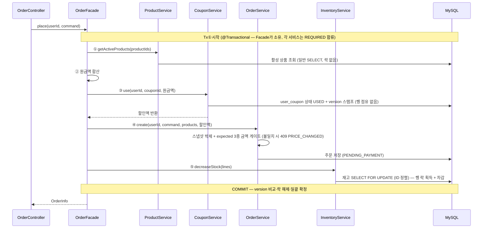
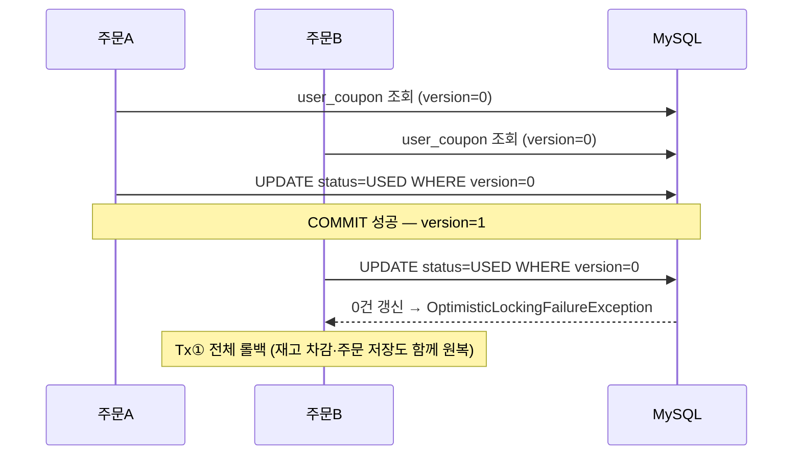
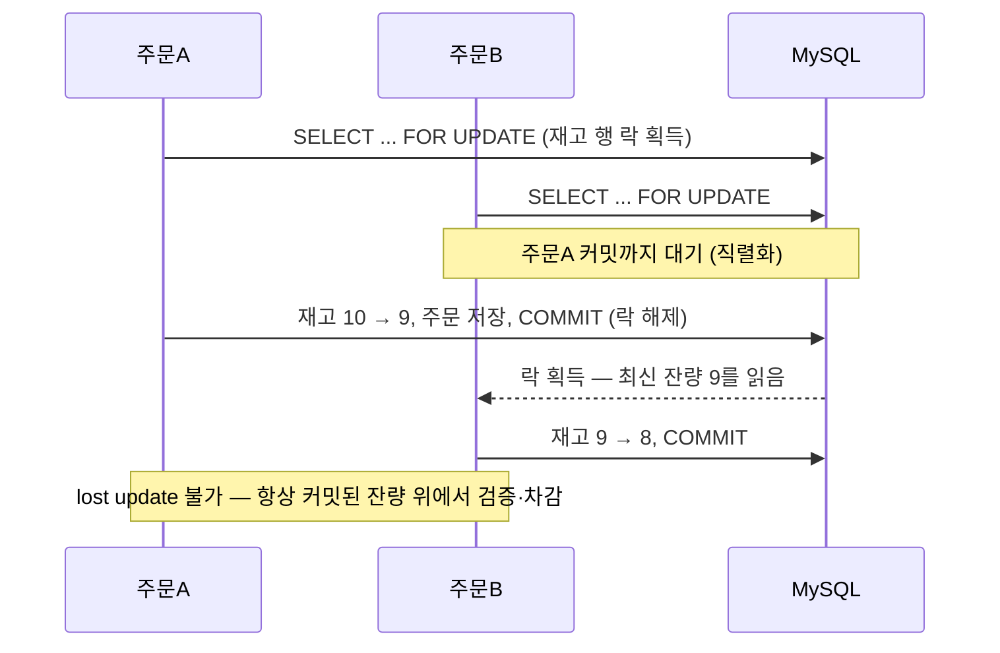
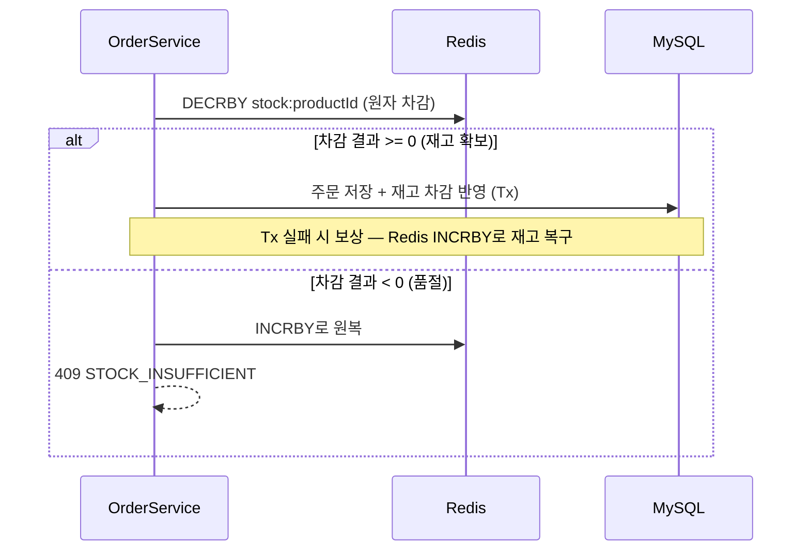

# Week4 — 동시성 락 설계와 한계

> 주문 플로우에 적용한 락(낙관/비관)의 설계 기준, 부하 측정으로 확인한 한계, 그리고 다음 단계 고민을 기록한다.
> 실측 상세는 [`load-test/RESULTS.md`](../../load-test/RESULTS.md), 설계 다이어그램은 [`08-concurrency-design.html`](08-concurrency-design.html) 참조.

---

## 1. 이번 주문 로직

`OrderFacade.place()`가 단일 트랜잭션(Tx①)을 소유하고 각 도메인 서비스를 지휘한다. 각 서비스(`ProductService`/`CouponService`/`OrderService`/`InventoryService`)는 자기 도메인만 담당하며 기본 전파(REQUIRED)로 Tx①에 합류한다. 원칙은 하나 — **싼 검증은 처음에, 비싼 락은 마지막에.**

- **Tx① 소유자는 `OrderFacade.place()`** — 유스케이스 지휘와 트랜잭션 경계가 한 곳에 있다. 추후 PG 연동 시 이 메서드의 Tx 구간을 안쪽 메서드로 분리해 `Tx① → 승인(Tx 밖) → confirm/fail(Tx②)` 구조로 확장한다.
- 각 서비스는 자기 도메인만 안다: `OrderService`는 스냅샷·금액 게이트·저장(주문 도메인 규칙), `InventoryService`는 FOR UPDATE 차감, `CouponService`는 사용 처리. 전부 REQUIRED 합류라 어느 단계에서 실패해도 한 덩어리로 롤백된다 — 부분 커밋이 구조적으로 불가능.
- 비관락(재고)이 주문 저장보다도 **뒤**다. 락 점유 구간이 "차감 + 커밋"만으로 줄어든다.
- 금액 게이트는 원금액/할인액/총액 3종을 전부 비교한다. 총액 1개 비교는 "원금↑ + 할인↑" 상쇄 변동을 통과시키기 때문.

---

## 2. 동시성이 발생하는 임계영역

| 임계영역 | 자원 | 성격 | 보호 수단 |
|---|---|---|---|
| 쿠폰 사용 | `user_coupon` 1행 | **논리적** 임계영역 — 행 점유 없음, 커밋 시 충돌 감지 | `@Version` 낙관락 + 상태 가드 + UK(user_id, coupon_id) |
| 재고 차감 | `inventory` 1행 | **물리적** 임계영역 — FOR UPDATE 획득~커밋까지 행 점유 | `PESSIMISTIC_WRITE` + productId 정렬(데드락 차단) + UK(product_id) |

### 2.1 user_coupon — 동시 사용 충돌

### 2.2 inventory — 동시 차감 직렬화

---

## 3. 각각 그 락을 선택한 이유

### 쿠폰 = 낙관적 락

- **유저 시나리오상 경합 주체가 본인뿐이다.** 한 사람이 같은 아이디로 같은 쿠폰을 동시에 여러 결제에 쓰는 일은 거의 없다 (더블클릭, 다중 기기 정도).
- 충돌이 드문 자원에 행 락을 잡는 것은 평상시 모든 주문에 불필요한 비용을 물리는 일이다. **임계영역을 만들지 않고**(점유 0) 커밋 때 version 비교 1회가 가장 싸다.
- 드물게 충돌하면 진 쪽 트랜잭션 전체 롤백 + 409 응답이면 충분하다.

### 재고 = 비관적 락

- **여러 사람이 하나의 상품을 동시에 사는 것은 흔한 유스케이스다.** 특히 세일·핫딜 기간에는 단일 상품 1행에 경합이 집중된다.
- 충돌이 잦은 자원에 낙관락을 걸면 N건 중 N-1건이 롤백→재시도 폭증으로 이어지고, 재시도 사이 잔량 검증이 어긋나면 초과 판매 위험이 있다.
- FOR UPDATE는 대기 비용을 내는 대신 **정확한 잔량 위에서 검증·차감**하므로 초과 판매가 구조적으로 불가능하다. 대기 비용은 락을 Tx 맨 마지막에 배치해 최소화했다.

> 검증: 동시성 통합 테스트 3종 green — 동일 쿠폰 10스레드 → 1건만 성공 / 재고 5개에 10스레드 → 5건 성공·잔량 0 / 동시 like 10건 → 카운트 정합.

---

## 4. 한계 — 부하 측정으로 확인한 것

서버(app + MySQL + Redis)는 EC2 t3.micro 1대, 부하 생성기(k6)는 로컬 PC로 분리해 1분 처리량을 측정했다. 서버 CPU는 vmstat 5초 간격 수집.

| 측정 (각 1분) | 처리량 | p95 | 서버 CPU |
|---|---:|---:|---:|
| 단일 상품 포화 주입 (300/s) | **93.0/s** | 4.52s | avg 94% |
| 상품 10개 분산 포화 (300/s) | **156.3/s** | 2.64s | avg 95% |
| 단일 상품 현실 부하 (50/s) | 50/s 전량 | **23.3ms** (p50 18.2ms) | ~50% |

확인한 사실:

1. **동시 처리 한계선**: 단일 인기 상품 기준 약 **93 TPS**가 천장이다. 분산 상황은 약 156 TPS(이 박스의 CPU 한계)까지 간다.
2. **실제 커머스 트래픽 대입**: 평시 주문은 한 상품에 초당 수십 건을 넘기 어렵고, 그 구간(50/s)에서는 p50 18.2ms로 락이 병목이 아니다. 그러나 **핫딜 오픈, 선착순 세일처럼 단일 상품에 수백~수천 RPS가 몰리는 순간**에는 93 TPS 천장에 바로 부딪힌다.
3. **병목은 DB row lock이다.** 두 가지가 증거다. ① 같은 CPU(~95%)를 태우면서 단일 상품은 분산 대비 40% 적게 처리한다 — 차이만큼이 락 대기 관리·직렬화 오버헤드로 샌다. ② 부하 생성기를 서버 밖으로 빼서 CPU를 확보하자 분산 천장은 +13/s 올라왔지만(143→156), 단일 상품 천장은 그대로였다(94.5→93). **CPU를 더 줘도 단일 상품 천장은 올라가지 않는다** — 원인이 자원 부족이 아니라 직렬화 그 자체라는 뜻이다.
4. 정합성은 지켜졌다 — 누적 주문 19,349건 = 재고 차감 19,349개, 초과 판매 0. **락은 약속을 지켰고, 대가는 처리량이다.**

---

## 5. 성능 측정에서 출발한 고민들

### 5.1 락 점유 구간 줄이기 (재고 업데이트 위치 조정)

- 락 점유는 "획득 → 커밋"까지 유지되므로, 재고 업데이트를 **앞으로** 당기면 점유가 오히려 길어진다. 현재 구조(검증 전부 통과 후 맨 마지막에 FOR UPDATE)가 Tx 안에서는 이미 최소다.
- 재고만 **별도 짧은 Tx로 선차감**하고 실패 시 보상하는 방안(REQUIRES_NEW)도 검토 — 실측 결과 기각. 줄어드는 락 구간이 주문 INSERT 1건뿐인데, 보상 실패 시 영구 재고 불일치 + 커넥션 2배 점유 + 본 Tx 실패 전 가짜 품절 윈도우를 떠안는다.
- 결론: **DB 락을 유지하는 한 직렬화 천장은 구조적**이다. 천장을 올리려면 락 구간을 줄이는 게 아니라 경합을 DB 밖으로 빼야 한다.

### 5.2 로컬 캐시 — 기각

- 재고를 앱 메모리에 들고 차감하면 DB 락 자체를 피할 수 있으나, **스케일 아웃 시 인스턴스마다 다른 재고를 보게 된다.** 인스턴스 간 정합성을 맞추려면 결국 분산 조정이 필요해 캐시의 의미가 사라진다.
- 단일 인스턴스 전제로만 성립하는 최적화라서 채택하지 않음.

### 5.3 Redis 재고 차감 — 다음 주차 적용 예정

재고를 Redis에 띄워두고 **Redis에서 원자 차감**한 뒤, 이후 단계 실패 시 다시 올려주는(복구) 구조를 도입할 계획이다.

- 기대 효과: 경합 지점이 MySQL row lock(점유 수 ms)에서 Redis 단일 연산(수십 µs)으로 이동 — 단일 상품 천장이 수천 TPS급으로 상승.
- 미리 인지한 과제:
  - **Redis-DB 정합성**: 차감은 Redis, 원장은 MySQL — 어긋났을 때 재동기화(스케줄러/재집계) 필요
  - **보상 실패**: DECR 후 앱이 죽으면 Redis 재고만 줄어든 채 남음 → TTL/대사(reconciliation) 설계 필요
  - **차감+검증 원자성**: `DECRBY` 후 음수 검사 방식은 순간 음수를 허용하므로, Lua 스크립트로 "검증+차감"을 한 연산으로 묶는 것 검토

---

## 정리

| 단계 | 선택 | 근거 |
|---|---|---|
| 지금 (Week4) | MySQL 락 (쿠폰 낙관 + 재고 비관) + 단일 Tx | 정합성 최우선, 현실 부하(50/s)에서 병목 아님을 실측 확인 |
| 기각 | Tx 분리 선차감, 로컬 캐시 | 이득 미미 + 보상 리스크 / 스케일 아웃 불가 |
| 다음 (Week5~) | Redis 원자 차감 + 실패 보상 | 단일 상품 천장(93 TPS, CPU 추가로도 불변)이 핫딜급 트래픽에 부족 — 경합을 DB 밖으로 |
