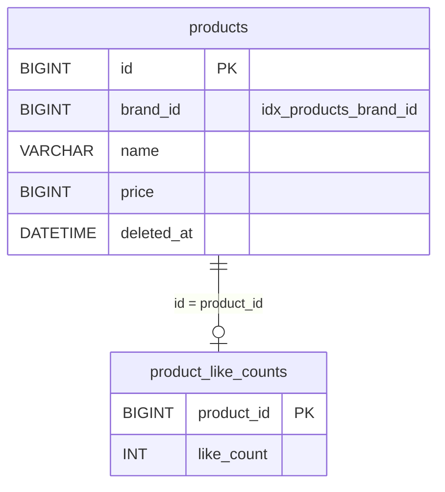
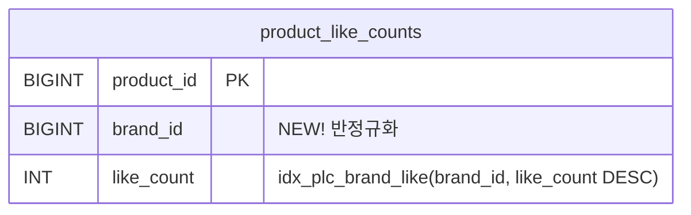

# 인덱스 설계를 통한 조회 속도 개선

## Question

`like_count`를 별도 테이블(`product_like_counts`)로 분리한 이후, 브랜드 필터 + 좋아요 순 정렬 조회를 어떤 인덱스로 최적화할 수 있는가?

## 현재 상황

### 테이블 구조



### 현재 인덱스

```
products:               PRIMARY(id), idx_products_brand_id(brand_id)
product_like_counts:    PRIMARY(product_id)
```

### 현재 쿼리

```sql
SELECT p.*
FROM products p
LEFT JOIN product_like_counts plc ON plc.product_id = p.id
WHERE p.deleted_at IS NULL
  AND p.brand_id = 50
ORDER BY plc.like_count DESC
LIMIT 20 OFFSET 0;
```

- `products`가 driving table, `product_like_counts`은 driven table
- 필터 조건 `brand_id`, `deleted_at`은 `products` 쪽 컬럼이다.
- 정렬 기준 `like_count`은 조인된 `product_like_counts` 쪽 컬럼이다.

## Setup

- 환경: MySQL 9.0.1, InnoDB, 로컬 단일 인스턴스
- 도구: `EXPLAIN ANALYZE`
- 데이터 규모:
  - `products` 100,000행
  - `product_like_counts` 97,047행
  - `brand_id` 100종 (브랜드당 약 1,000개)
  - `like_count` 랜덤 값

## AS-IS 측정

### EXPLAIN
```sql
| id | table | type | possible_keys | key | rows | filtered | Extra |
|----|-------|------|---------------|-----|------|----------|-------|
| 1 | p | ref | idx_products_brand_id | idx_products_brand_id | 1013 | 10.00 | Using where; Using temporary; Using filesort |
| 1 | plc | eq_ref | PRIMARY | PRIMARY | 1 | 100.00 | NULL |
```

### EXPLAIN ANALYZE

```
⑤-> Limit: 20 row(s)  (actual time=21.5..21.5 rows=20 loops=1)
    -> Sort: plc.like_count DESC, limit input to 20 row(s) per chunk
        (actual time=21.5..21.5 rows=20 loops=1)
        -> Stream results  (cost=299 rows=101)
            (actual time=1.01..21.1 rows=991 loops=1)
          ④ -> Nested loop left join  (cost=299 rows=101)
                (actual time=0.963..20.6 rows=991 loops=1)
              ② -> Filter: (p.deleted_at is null)  (cost=263 rows=101)
                    (actual time=0.724..7.2 rows=991 loops=1)
                  ① -> Index lookup on p using idx_products_brand_id (brand_id=50)
                        (cost=263 rows=1013)
                        (actual time=0.723..7.13 rows=1013 loops=1)
              ③ -> Single-row index lookup on plc using PRIMARY (product_id=p.id)
                    (cost=0.251 rows=1)
                    (actual time=0.0133..0.0133 rows=1 loops=991)
```

### 해석

| 단계 | 동작                                         | 영향받은 행 수  |
|--|--------------------------------------------|-----------|
| ① | `idx_products_brand_id`로 brand_id=50 상품 조회 | 1,013행 읽음 |
| ② | `deleted_at IS NULL` 필터로 걸러서               | 991행 남음   |
| ③ | 각 상품마다 `like_count` 찾기 위해 `plc` PK lookup  | 991번 수행   |
| ④ | 전체 결과를 `plc.like_count DESC`로 filesort     | 991행 정렬   |
| ⑤ | 해당 결과에서 상위 20행 반환                          | 20행       |

소요시간 21.5ms, filesort 있음

### 문제 파악
- `brand_id`만 필터링에 사용하고 나머지 조건은 사용할 수 없어, 해당되는 브랜드 전체를 읽어야 한다.
- 읽어낸 결과 991행을 조인하고 다시 정렬하는 비효율적 작업을 하고 있다.
- 정렬 기준인 `like_count`가 기준 테이블이 아닌 조인된 테이블의 컬럼에 있어, 조인 이후에 정렬이 가능하므로 filesort가 불가피하다.
## 개선 방향
filesort는 쿼리의 속도를 느리게 하기에 가능하다면 발생하지 않도록 하는 것이 좋다.

현재 실행계획에서 filesort가 발생하는 이유는
`like_count`가 `product` 테이블에서 사라졌기 때문에, 인덱스가 정렬된 순서대로 탐색할 수 없었기 때문이다.

따라서 특정 브랜드순으로 필터링한 결과가 좋아요 수 순서로 정렬되어 있다면 filesort가 발생하지 않을 것이라 예측 가능하다.

이 때 적절한 인덱스는 `(brand_id, like_count DESC)` 복합 인덱스이다.

그런데 현재 `brand_id`는 `product` 테이블에만 존재하기 때문에 복합 인덱스를 만들 수 없다.
따라서 반정규화를 통해 `product_like_counts` 테이블에 `brand_id`를 추가했다.

### 반정규화 후 테이블 구조



- `brand_id`를 `product_like_counts`에 반정규화하여, 단일 테이블 내에서 `(brand_id, like_count DESC)` 복합 인덱스를 구성할 수 있게 된다.
- 이 인덱스를 통한다면 `brand_id = ?` 구간 내의 데이터가 이미 `like_count DESC` 순서로 정렬되어 있으므로, filesort 없이 인덱스 순서대로 읽기만 하면 된다.

## TO-BE 측정

예상대로 작동하는지 확인해본다.

### 인덱스 추가

```sql
ALTER TABLE product_like_counts ADD INDEX idx_plc_brand_like (brand_id, like_count DESC);
```

#### EXPLAIN
```
| id | table | type | possible_keys | key | rows | filtered | Extra |
|----|-------|------|---------------|-----|------|----------|-------|
| 1 | p | ref | idx_products_brand_id | idx_products_brand_id | 1013 | 10.00 | Using where; Using temporary; Using filesort |
| 1 | plc | eq_ref | PRIMARY | PRIMARY | 1 | 100.00 | NULL |
```

그런데 인덱스를 추가했는데도 옵티마이저가 여전히 `products`를 driving 테이블로 선택했고, 새로 추가한 인덱스를 사용하지 않는 계획을 짰다.

#### EXPLAIN ANALYZE
```
-> Limit: 20 row(s)  (actual time=25.2..25.2 rows=20 loops=1)
    -> Sort: plc.like_count DESC, limit input to 20 row(s) per chunk
        (actual time=25.2..25.2 rows=20 loops=1)
        -> Stream results  (cost=299 rows=101)
            (actual time=1.16..24.7 rows=991 loops=1)
            -> Nested loop left join  (cost=299 rows=101)
                (actual time=1.13..24.2 rows=991 loops=1)
                -> Filter: (p.deleted_at is null)  (cost=263 rows=101)
                    (actual time=1.12..22.8 rows=991 loops=1)
                    -> Index lookup on p using idx_products_brand_id (brand_id=50)
                        (cost=263 rows=1013)
                        (actual time=1.12..22.8 rows=1013 loops=1)
                -> Single-row index lookup on plc using PRIMARY (product_id=p.id)
                    (cost=0.251 rows=1)
                    (actual time=0.00123..0.00125 rows=1 loops=991)
```

결과: 25.2ms, filesort 여전히 존재..

### 이유가 무엇일까
상품 목록을 조회하는 것이기 때문에, 핵심 정보는 상품의 정보라고 생각했다.

그래서 만일 좋아요 집계 테이블에 연관된 행이 없더라도, 정상적으로 상품을 표시해야 한다는 생각으로 쿼리에 LEFT JOIN을 사용하도록 설계했다.

그래서 여전히 `product`가 driving 테이블로 잡히기 때문에 우리가 추가한 인덱스를 사용하지 못하게 된다.

해결 방법은 간단했다. INNER JOIN으로 조인 방식을 변경하는 것이다.

## 해결 방법
### INNER JOIN 변경 + 인덱스

이제 테이블 조인이 INNER JOIN으로 변경되었다.

```sql
SELECT p.*
FROM product_like_counts plc
JOIN products p ON p.id = plc.product_id
WHERE plc.brand_id = 50
  AND p.deleted_at IS NULL
ORDER BY plc.like_count DESC
LIMIT 20 OFFSET 0;
```

#### EXPLAIN
```
| id | table | type | possible_keys | key | rows | filtered | Extra |
|----|-------|------|---------------|-----|------|----------|-------|
| 1 | plc | ref | PRIMARY,idx_plc_brand_like | idx_plc_brand_like | 991 | 100.00 | Using index |
| 1 | p | eq_ref | PRIMARY | PRIMARY | 1 | 10.00 | Using where |
```

#### EXPLAIN ANALYZE
```
-> Limit: 20 row(s)  (cost=449 rows=20) (actual time=0.0496..0.335 rows=20 loops=1)
    -> Nested loop inner join  (cost=449 rows=99.1)
        (actual time=0.049..0.333 rows=20 loops=1)
        -> Covering index lookup on plc using idx_plc_brand_like (brand_id=50)
            (cost=103 rows=991) (actual time=0.024..0.0296 rows=20 loops=1)
        -> Filter: (p.deleted_at is null)  (cost=0.25 rows=0.1)
            (actual time=0.0148..0.0149 rows=1 loops=20)
            -> Single-row index lookup on p using PRIMARY (id=plc.product_id)
                (cost=0.25 rows=1) (actual time=0.0145..0.0145 rows=1 loops=20)
```

결과: 0.33ms, filesort 없음

#### 해석

| 단계 | 동작                                                           | 영향받은 행 수 |
|--|--------------------------------------------------------------|---------|
| ① | `idx_plc_brand_like`로 brand_id=50 구간을 like_count DESC 순서로 읽기 | 20행 |
| ② | 각 행의 `product_id`로 `products` PK lookup                      | 20번 |
| ③ | `deleted_at IS NULL` 필터                                      | 20행 |
| ④ | 위 과정을 LIMIT 조건 충족할때까지 반복                                     | 20행 |

실행 과정을 확인해보면, 복합 인덱스가 생긴 덕분에 brand_id = 50 구간이 이미 like_count별로 정렬되어 있다.

따라서 brand를 전부 읽어야 했던 이전 계획과는 다르게 필요한 건수에 도달하기 위한 범위를 좁힐 수 있게 된 것이다. 별도의 정렬 역시 필요 없어진다.

이번 실행에서는 처음 읽은 20행이 모두 적합한 결과라 20행만 확인하고 종료되었지만
만약 `deleted_at IS NULL`에 영향을 받을 수 있는 시나리오, 예를 들면 반대로 삭제 상품 비율이 매우 높다면 이 인덱스는 사용되지 않을 가능성도 있다.

#### 주의점
다만, 주의할 점이 있다. 조인 방법을 변경해서 driving 테이블이 `product_like_counts`가 되면서 예상하지 못한 상황이 생길 수 있기 때문이다.

- 만약 product 테이블에는 3번 상품이 존재, 그러나 product_like_counts에는 3번 상품의 좋아요 기록 없음.
  - 이러한 경우 INNER JOIN에서 아예 3번 상품에 대한 결과가 사라짐

현재 배치(`LikeCountSyncTasklet`)는 모든 활성 상품에 대해 UPSERT하므로 배치 실행 후에는 누락이 없다.
다만 배치 주기 사이에 신규 등록된 상품은 빠질 수 있으므로, 상품 생성 시 `product_like_counts`에 초기 행을 함께 삽입하는 것이 안전하다.

## Decision

- 선택: `product_like_counts`에 `(brand_id, like_count DESC)` 복합 인덱스 + 쿼리 방향 변경
- 선택 이유: filesort 제거됨, 탐색해야 하는 행 대폭 감소, 실행 시간 약 65배 개선
- 포기한 것: 현재 쿼리 구조 유지 — 인덱스만 추가해서는 정렬 최적화가 불가능했다
- 추가 비용: `brand_id` 반정규화에 따른 데이터 정합성 관리 (배치 동기화 시 함께 갱신)