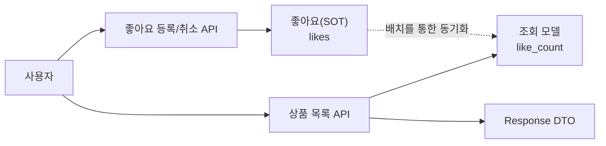
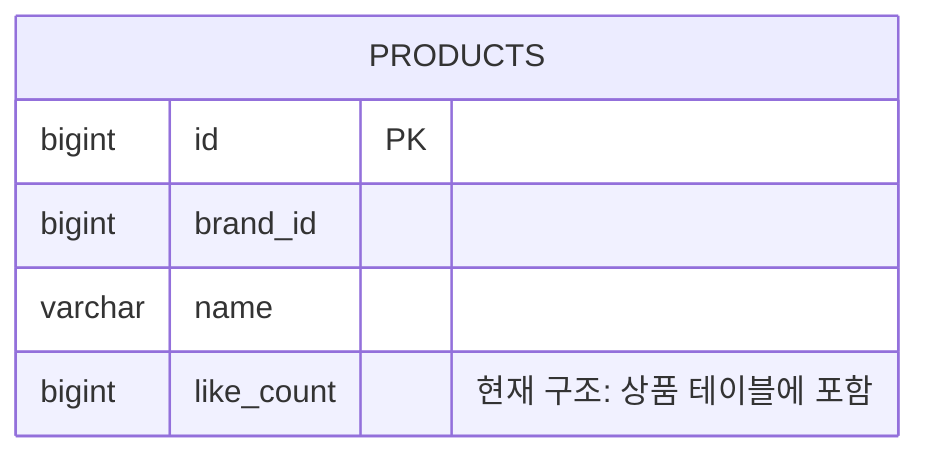
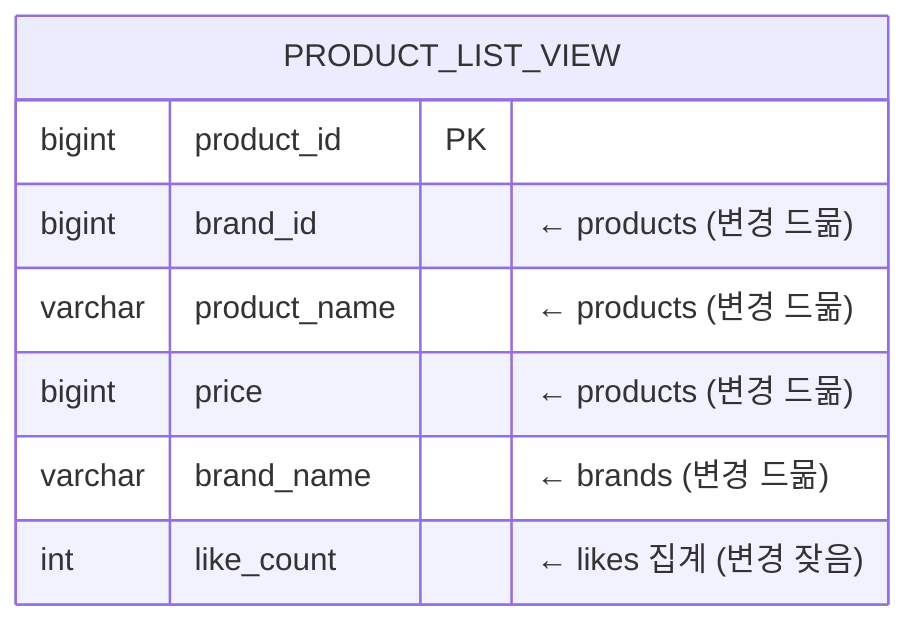
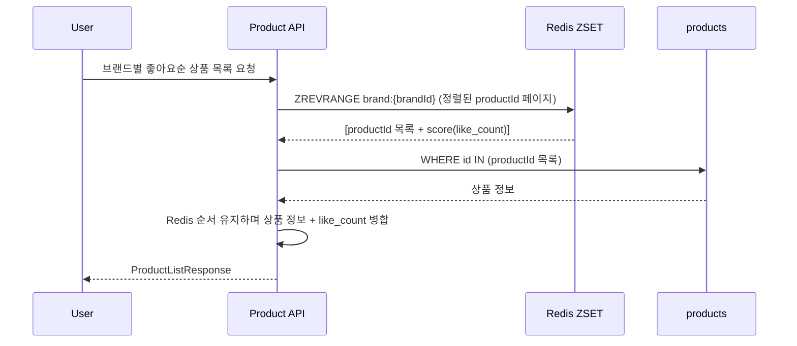
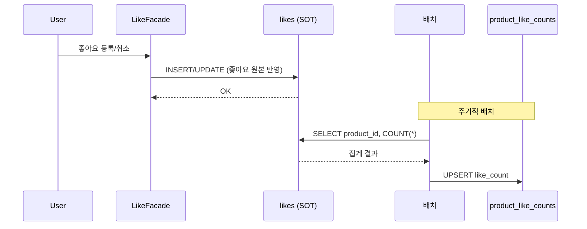
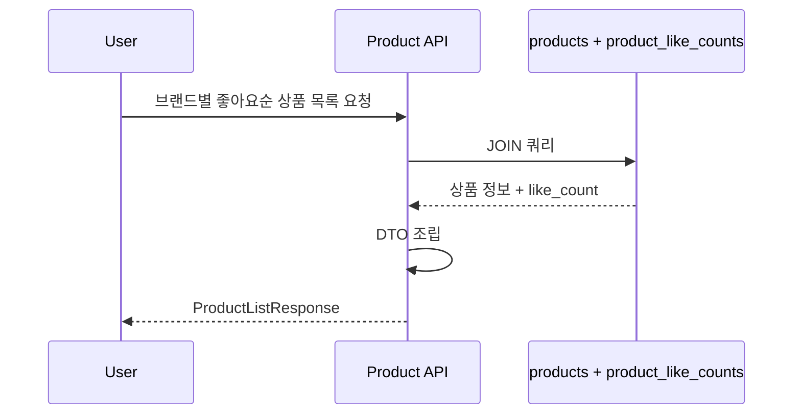

## 좋아요 수 정렬 구조 개선하기

기존 설계에서 `products` 테이블의 `like_count`가 이미 비정규화되어 있지만, 해당 구조의 단점을 정리해보고 개선할 수 있는 방법을 찾았다.

### 전제

좋아요의 원본 데이터는 `likes` 테이블이다. `like_count`는 원본이 아니라 목록 정렬과 응답을 빠르게 만들기 위한
집계 데이터이다. 따라서 어떤 방법을 선택하더라도 SOT(Source of Truth)인 `likes`를 기준으로 count를 다시 만들 수 있어야 한다.



### 기존 비정규화 컬럼의 문제점

- 애그리거트가 다른 두 도메인이 하나의 테이블에 합쳐져 있음
    - 편의를 위한 방법이긴 하지만, 상품이 좋아요 정보를 알게 되어 도메인 간의 의존 관계가 생김
- 상품의 정보들과 좋아요 집계는 변경 빈도에 차이가 있음
    - 일반적으로 상품의 정보들은 한 번 고정되면 자주 바뀌는 값이 아니지만, 좋아요 집계는 주기적인 업데이트가 필요해짐
    - 만일 SOT 업데이트마다 `like_count`를 갱신한다면 추가적인 Lock 경합으로 인한 응답 지연이 생길 수 있음



현재 구조는 조회에는 단순하지만, `products`가 상품의 상태와 좋아요 집계 상태를 함께 들고 있다.
그래서 좋아요가 바뀔 때마다 상품 테이블의 row도 같이 갱신되어야 하는 것이 핵심 문제점이라고 볼 수 있었다.

### 방법1 : 별도의 like_count 집계 테이블 만들기

상품별 좋아요 카운트를 저장하는 별도의 집계 테이블을 만든다.

집계 테이블에는 `product_id`, `like_count` 컬럼이 있으며, 해당 컬럼은 배치를 통해 주기적으로 갱신하여 정합성을 맞춘다.

조회 시에는 상품 테이블과 `like_count` 집계 테이블을 join하여 결과를 반환한다.


```sql
SELECT p.*, plc.like_count
FROM products p
JOIN product_like_counts plc ON plc.product_id = p.id
WHERE p.brand_id = ?
  AND p.deleted_at IS NULL
ORDER BY plc.like_count DESC
LIMIT ? OFFSET ?;
```
- 좋아요 집계를 상품 테이블에서 분리하여 각 애그리거트 경계를 명확히 할 수 있음
- 좋아요 집계 결과의 정합성은 최종적으로 맞춰진다는 설계이므로, 실제 좋아요 값과 일시적 불일치가 발생할 수 있음

### 방법2 : 별도 조회용 뷰를 만들기

CQRS 관점에서 Materialized View 성격의 조회 테이블을 별도로 생성한다.



이 방법은 목록 조회가 가장 단순해진다. 상품 목록에 필요한 상품 정보, 브랜드 정보, 좋아요 수가 하나의 조회 테이블에
모여 있기 때문이다.

하지만 기존 방법과 비슷한 문제가 생길 수 있다. `like_count`는 상품명, 가격, 브랜드명보다 변경 빈도가 높다.
따라서 하나의 조회 테이블에 모든 값을 넣으면 좋아요 변경 때마다 목록 조회 테이블의 row가 계속 갱신된다.

### 방법3 : Redis로 like_count 관리하기

별도의 RDB 집계 테이블 대신 Redis에 `like_count`를 관리하는 방법이다.

좋아요에 변동이 있으면 SOT에 반영하는 것과 동시에 Redis에서도 값을 변경하고, 값을 반환할 때는 Redis에서 좋아요 수만 가져와서 DTO를 만들어서 반환한다.

그런데 이러한 방법에는 한 가지 복잡한 고려사항이 생긴다. 바로 `like_count` 기준 정렬이 복잡해진다는 것이다.

`like_count`는 Redis에만 존재하는 값이기 때문에, Redis에서 정렬 후 해당되는 `product_id`를 찾아서 DB 조회 후,
`like_count`와 합쳐서 반환해야 한다.



이 방법은 DB가 아닌 Redis가 정렬을 담당한다. Redis가 먼저 정렬된 `productId`를 반환하고
애플리케이션이 이후에 응답을 조립해야 한다.

이러한 경우 다음과 같은 문제점을 생각해볼 수 있다.

- Redis에 조회의 핵심 기능 의존이 발생한다. 만일 Redis에 문제가 생기면 정렬을 할 수 있는 방법이 없다.
- 콜드 캐시 상황, Redis에 상품 좋아요 카운트가 반영되어 있지 않은 경우 등의 문제가 생길 수 있다.

## 선택한 방법

최종적으로는 별도의 집계 테이블을 만들되, 상품 정보와 join해 결과를 만드는 방법 1을 선택했다.

상품 테이블과 좋아요 집계의 관리 책임을 분리하고, like_count를 Redis 단독으로 관리하는데서 오는 문제점을 피하기 위한 선택이었다.

하지만 추후 확장 방향은 방법 2도 함께 고려할 수 있다.

지금은 상품 테이블과 집계 테이블을 join 하면 끝이지만, 만일 반환해야 하는 정보들이 더 많아진다면 상품 테이블을 직접
이용하는 방법 대신, Materialized View 성격의 `product_list_view`를 추가로 만들어서 `product` 테이블 대신 활용할 수 있을 것 같다.

### 최종 구조

`likes`를 SOT로 두고, 좋아요 수는 별도 집계 테이블인 `product_like_counts`에 저장한다.
상품 목록 조회는 상품 테이블과 count 테이블을 join하여 DTO를 만든다.

#### 쓰기 경로 — 좋아요 등록/취소



#### 읽기 경로 — 상품 목록 조회



### 방법 비교

| 방법 | 정렬 기준 위치 | 장점 | 단점 | 판단 |
|---|---|---|---|---|
| 방법1. 별도 count 테이블 | RDB `product_like_counts` | 상품과 좋아요 집계 책임 분리, count만 독립 갱신 가능 | 상품 정보와 count를 응답 시 조합해야 함 | 선택 |
| 방법2. 목록 조회 mview | RDB `product_list_view.like_count` | 조회 쿼리 가장 단순, 응답 조립 비용 적음 | 변경 빈도 다른 필드가 한 테이블에 섞임 | 반환 필드 증가 시 후속 검토 |
| 방법3. Redis count/ZSET | Redis | 좋아요 count 변경이 빠름, 랭킹 조회 빠름 | Redis가 정렬 핵심 경로가 되고 동기화/복구 전략이 필요함 | 이번 선택에서는 제외 |
