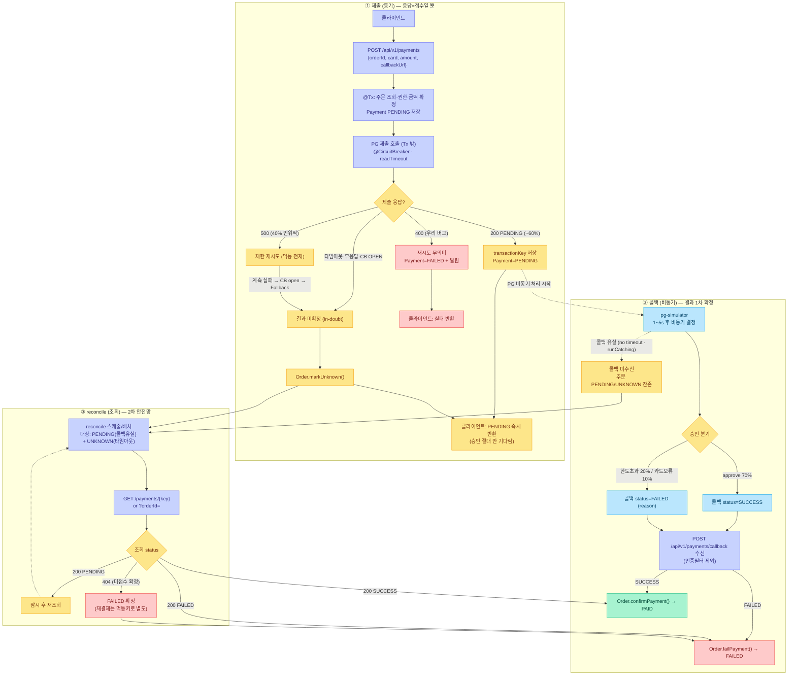
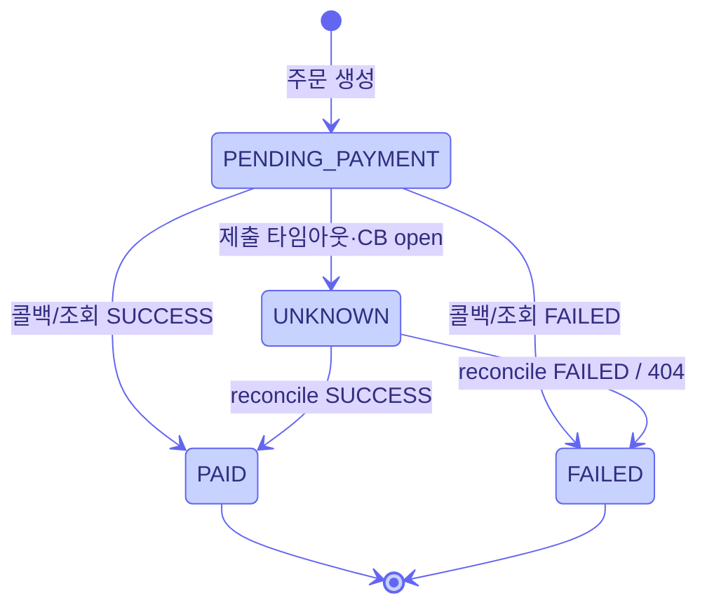

# Payment 전체 플로우 + 모든 케이스 (Week6)

> 출처: `apps/pg-simulator` 실제 소스 + [pg-simulator-responses.md](../pg-simulator-responses.md). 추측 아님.
> 작성: 2026-06-25

## 핵심 모델 (오해 교정)

흔히 "① 응답으로 성공 처리 → ② 콜백으로 2차 확인"으로 생각하기 쉬운데 **틀리다.**

| 단계 | 무엇 | 의미 |
|---|---|---|
| ① POST 응답 | **접수(PENDING)일 뿐** | 성공 아님. 게다가 40% 500 실패·타임아웃 가능 → 못 받으면 **UNKNOWN** |
| ② 콜백 수신 | **결과 1차 확정** | SUCCESS→PAID / FAILED→FAILED. 단 **콜백은 유실 가능**(no timeout, runCatching) |
| ③ GET 조회 reconcile | **2차 안전망** | 콜백 유실·UNKNOWN을 조회로 PAID/FAILED 해소 |

→ **"응답=접수 / 콜백=확정 / 조회=안전망"**. 응답은 성공 신호가 아니다.

---

## 전체 플로우차트 (모든 케이스)

---

## 주문 상태 머신 (OrderStatus)

---

## 케이스 표 (MECE)

### 제출(POST) 응답
| # | 응답 | 조건 | 우리 대응 | 주문 상태 |
|---|---|---|---|---|
| 1 | 200 PENDING | 접수 성공(~60%) | transactionKey 저장, 결과 대기 | PENDING_PAYMENT |
| 2 | 400 | X-USER-ID 누락 / 본문검증 / 직렬화 | **우리 버그** — 재시도 X, 즉시 실패+알림 | FAILED |
| 3 | 500 | 40% 인위적 실패 / 예상외 오류 | 제한 재시도(멱등) → 계속 실패 시 CB open | (재시도 후 UNKNOWN) |
| 4 | 무응답 | 타임아웃·커넥션 실패 | **in-doubt** → markUnknown | UNKNOWN |
| 5 | CallNotPermitted | CB OPEN | Fallback → markUnknown | UNKNOWN |

### 비동기 결과 (콜백 / 조회 공통)
| 분기 | 확률 | status | 우리 매핑 |
|---|---|---|---|
| approve | 70% | SUCCESS | → PAID |
| limitExceeded | 20% | FAILED(한도초과) | → FAILED |
| invalidCard | 10% | FAILED(잘못된 카드) | → FAILED |
| 콜백 유실 | — | (미수신) | reconcile로 해소 |

### GET 조회 (reconcile)
| 응답 | 의미 | 대응 |
|---|---|---|
| 200 SUCCESS | 승인 확정 | → PAID (멱등) |
| 200 FAILED | 실패 확정 | → FAILED |
| 200 PENDING | 처리 중 | 잠시 후 재조회 |
| 404 | 미접수(접수 자체 실패) | FAILED 확정 (재결제는 멱등키로 별도) |

---

## 한 줄 요약

- **400 = 고쳐라(재시도 X)** / **404 = 조회 타이밍** / **500·타임아웃·콜백유실 = 미확정 → 조회로 확인(막 재결제 X)**
- 콜백을 **믿되 의존하지 않는다** — 유실 가능하므로 **조회 reconcile이 진짜 안전망**
- 주문 상태는 결국 **PAID · FAILED · UNKNOWN** 세 가지로 수렴
